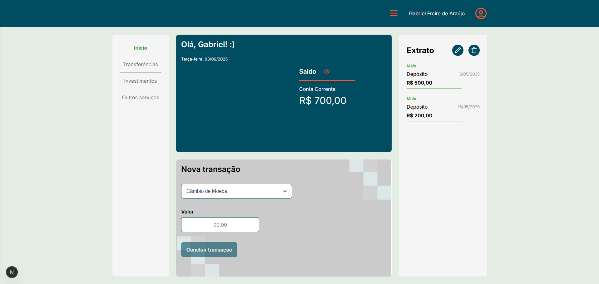

# 💸 Projeto de Transações Financeiras

Este projeto é uma aplicação web para controle de transações financeiras.

## 🧪 Tecnologias utilizadas

- [Next.js](https://nextjs.org/) – Framework React com SSR/SSG
- [TypeScript](https://www.typescriptlang.org/) – Tipagem estática
- [Stitches](https://stitches.dev/) – CSS-in-JS com estilo moderno e responsivo
- [Lucide React](https://lucide.dev/) – Ícones SVG para React
- [JSON Server](https://github.com/typicode/json-server) – API REST fake para testes
- Programação Orientada a Objetos (POO)

## 🖼️ Preview do Projeto



## 🚀 Como rodar o projeto localmente

```bash
# 1. Instale as dependências do projeto
npm install

# 2. Popule o banco de dados (JSON Server)
npm run seed

# 3. Altere o nome do arquivo .env.example para .env
mv .env.example .env

# 4. Inicie o JSON Server
npm run json-server

# 5. Rode o projeto Next.js
npm run dev